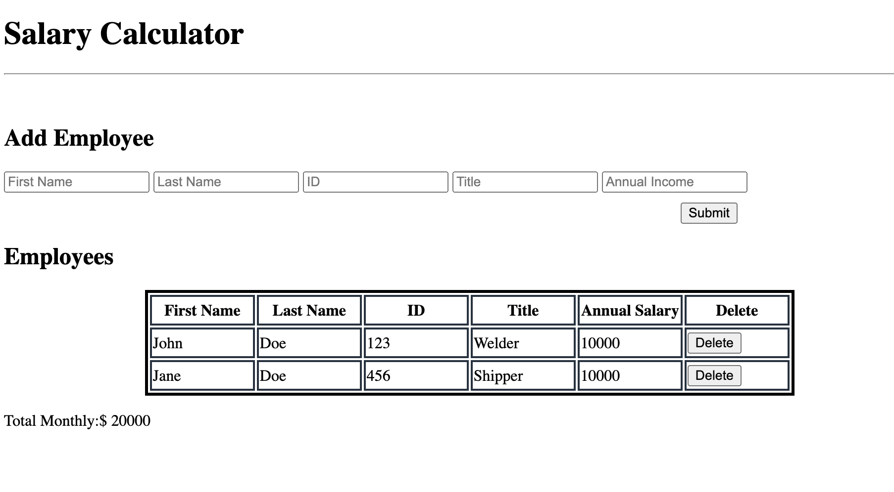
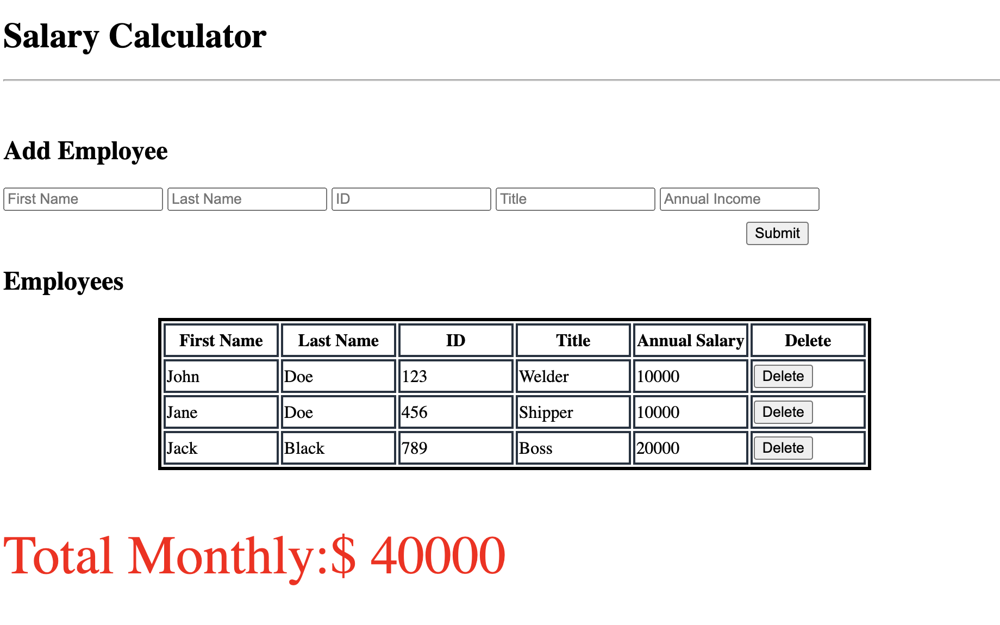

# PROJECT NAME
Salary Calculator
## Description
Directly above this is how long it took you to develop the project. Your project description goes here. What problem did you solve? How did you solve it? 

_Duration: 3 days_

This is an application to track employee annual salary and maintian budgeting margins are within spending limits. The application will take the challenge of tracking employees who have joined the team and also who left by inputing employee data into web page. All while ensuring that the budget never exceed a given value by flaggin user.

## Screen Shot




### Prerequisites

Link to software that is required to install the app (e.g. node).

- [Node.js](https://nodejs.org/en/)
- [Node Package Manager](https://www.npmjs.com/) 

## Installation

1. **Use this template** to create a GitHub repo on your account
2. Clone the repo on to your computer
3. Open up your editor of choice and run an `npm install`
4. In the project folder, run `npm init --yes`
5. Install express `npm install express`
6. Set up server:

**server.js**

```JavaScript
const express = require('express');


const app = express();
const port = process.env.PORT || 5001;

app.use(express.static('server/public'));

app.listen(port, () => {
  console.log('listening on port', port);
});
```   
## Testing the Server

You should be able to run your code by navigating to [http://localhost:5001](http://localhost:5001).


## Usage

1. Enter employee information in input fields
2. Click the 'Submit' button to add information to table
3. You can delete employees who are no longer employed by clicking the 'Delete' button
4. The 'Total Monthly' will continue to add up employees annual salary
5. The user will be flagged if the set 'value' is over budget


## Built With

Client Side: 
 - Javascript
 - HTML/CSS

Server Side: 
 - Express
 - Javascript
 - Node

Database
- Postgres

## Acknowledgement
Thanks to [Prime Digital Academy](www.primeacademy.io) who equipped and helped me to make this application a reality. Thanks to the #titanite cohort for the support!

## Support
If you have suggestions or issues, please email me at [youremail@whatever.com](www.google.com)